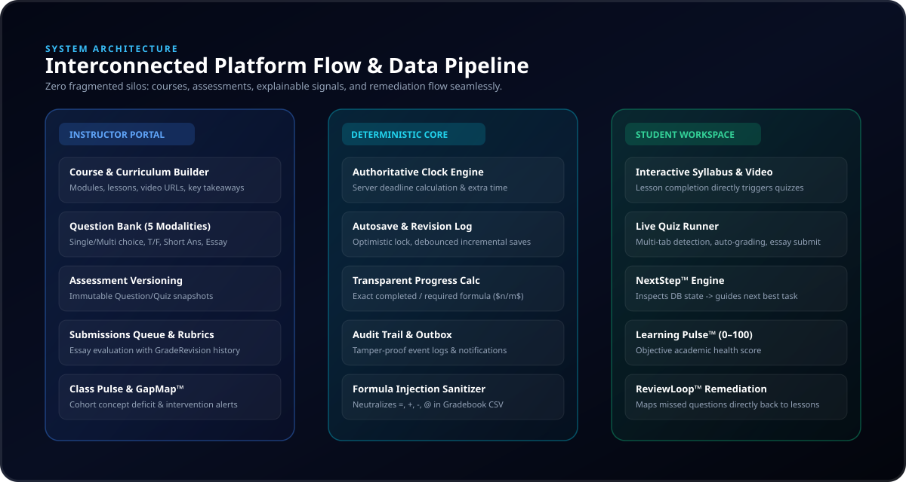
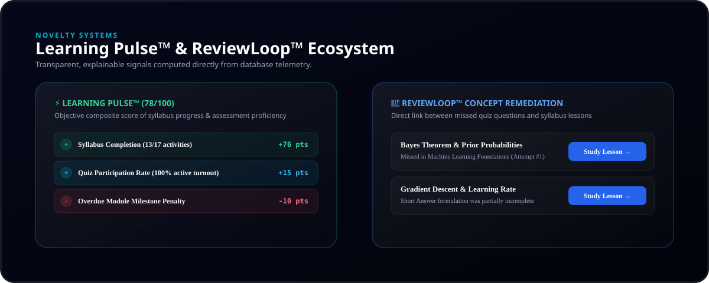

<div align="center">

# ⚡ NEXORA LEARN
### *Learn smarter. Practice better. Know what to do next.*



[](https://nexora-learn-gold.vercel.app)
[](https://nexora-learn-gold.vercel.app)
[](https://nextjs.org/)
[](https://www.typescriptlang.org/)
[](https://tailwindcss.com/)
[](https://www.prisma.io/)
[](https://vitest.dev/)
[](https://github.com/codexanjan/nexora-lmz-quiz)
[](#-multi-language-experience-6-locales)
[](LICENSE)

<br/>

**🌐 Live Production App**: [https://nexora-learn-gold.vercel.app](https://nexora-learn-gold.vercel.app)  
**🚀 Direct Vercel Deployment**: [https://nexora-learn-drf111fye-krotrex-2830s-projects.vercel.app](https://nexora-learn-drf111fye-krotrex-2830s-projects.vercel.app)  
**📂 GitHub Repository**: [https://github.com/codexanjan/nexora-lmz-quiz](https://github.com/codexanjan/nexora-lmz-quiz)

</div>

---

## 🌟 What is Nexora Learn?

**Nexora Learn** is a next-generation **Learning Management System (LMS) + Assessment Platform + Academic Intelligence Engine**.

Legacy LMS platforms (such as Canvas, Blackboard, or Moodle) isolate lessons, quizzes, gradebooks, and analytics into disconnected silos. Nexora Learn unifies them into an **interconnected, closed-loop intelligence ecosystem**:

- **Continuous Cognitive Flow**: Lessons transition into module assessments; quiz submissions instantly calculate the student's **Learning Pulse™** and trigger targeted remediation in **ReviewLoop™** with direct links back to syllabus lessons.
- **100% Explainable & Rule-Based (Zero Black-Box AI)**: No opaque AI hallucination scores, token costs, or unpredictable outputs. Every recommendation, risk alert, and metric is calculated deterministically from real database telemetry.
- **Multilingual Native Experience**: Instant switching across 6 world languages (🇺🇸 English, 🇪🇸 Español, 🇫🇷 Français, 🇩🇪 Deutsch, 🇮🇳 हिन्दी, 🇯🇵 日本語) stored locally with zero external API dependencies.
- **Server-Authoritative Anti-Tamper Timing**: Quiz countdowns and deadlines are strictly enforced by server clocks ($\min(\text{closingDate}, \text{startedAt} + \text{duration} + \text{accommodations})$), completely immune to client system clock modifications.

---

## ⚡ At a Glance: Key Innovations

| Feature | What It Does | Why It Matters |
|:---|:---|:---|
| 🧠 **Learning Pulse™** | Objective student health score ($0\text{--}100$) based on syllabus progress, grades, participation, and overdue penalties. | Students always know their standing with zero opaque AI guessing. |
| 🧭 **NextStep™ Engine** | Rule-based guide evaluating live state: unfinished lessons ➔ module quizzes ➔ released grades ➔ remediation cards. | Directs learners to their single highest-leverage task immediately. |
| 🔁 **ReviewLoop™** | Analyzes incorrect assessment answers, groups them by concept tags, and generates remediation paths to specific lessons. | Eliminates passive failure; turns every quiz into a personalized review loop. |
| 📊 **GapMap™ & Class Pulse** | Instructor cohort view grouping student error rates by concept; detects at-risk learners with 1-click gradebook jump. | Teachers spot cohort-wide misunderstandings before midterms or finals. |
| ⏱️ **Server-Authoritative Clock** | Dynamic countdown synced with server timestamps; multi-tab conflict detection & autosave with revision locking. | Complete assessment integrity without invasive client-side surveillance. |
| 🌐 **6-Language i18n** | Full native translations across English, Spanish, French, German, Hindi, and Japanese. | Seamless global academic accessibility without translation latency. |

---

## ⚔️ Nexora Learn vs. Legacy LMS Platforms

| Capability | Legacy LMS (Moodle / Canvas) | Nexora Learn ⚡ |
|:---|:---:|:---:|
| **Workflow Connectivity** | Disconnected tabs & menus | **Seamless Closed-Loop Architecture** |
| **Post-Quiz Remediation** | Static grade with no next steps | **ReviewLoop™ direct lesson remediation** |
| **Student Health Score** | Buried grade percentages | **Learning Pulse™ (0–100) Explainable Metric** |
| **Intelligence Engine** | None, or expensive third-party AI | **100% Explainable, Zero AI Token Costs** |
| **Quiz Timing Integrity** | Vulnerable to client time drift | **Server-Authoritative anti-tamper clock** |
| **Language Switching** | Requires full page reload | **Instant client-side hot-swapping (6 locales)** |
| **User Interface** | Dated 2010s enterprise portal | **Modern Cyber-Academic Dark Glassmorphism** |
| **Data Safety** | Raw spreadsheet exports vulnerable to formula injection | **Automated CSV Sanitization (`=`, `+`, `-`, `@`)** |

---

## 🏗️ System Architecture & Interconnected Flow



### The Continuous Closed-Loop Pipeline

```
[Teacher Creates Course & Syllabus]
            │
            ▼
[Question Bank (5 Modalities)] ──► [Quiz Builder (Versions & Timing)]
                                                  │
                                                  ▼
                                     [Published to Enrolled Students]
                                                  │
 ┌────────────────────────────────────────────────┴───────────────────────────────┐
 │                                                                                │
 ▼                                                                                ▼
[Student: NextStep™ Engine]                                          [Student: Interactive Syllabus]
 guides next highest-leverage task                                   reads lesson, video & takeaways
 │                                                                                │
 └───────────────────────────────┬────────────────────────────────────────────────┘
                                 │
                                 ▼
                     [Module Assessment Ready]
                     (Direct 1-click launch from lesson)
                                 │
                                 ▼
                     [Live Quiz Taking Engine]
                     (Autosave, revision counters, anti-tamper)
                                 │
                                 ▼
                     [Deterministic Grading]
                     - Objective: Instant Scoring
                     - Essay: Teacher Rubric Queue
                                 │
                                 ▼
                     [Student Result & Feedback]
                     - Question Analysis & Rubric Comments
                     - Course Syllabus Return Button
                     - Retake Assessment Button (if attempts remain)
                                 │
                                 ▼
         ┌───────────────────────┴───────────────────────┐
         │                                               │
         ▼                                               ▼
[⚡ Learning Pulse™ (0–100)]                 [🔁 ReviewLoop™ Queue]
Transparent academic health index            Concept tags mapped directly
(+Syllabus, +Participation, -Overdue)        to recommended lessons for review!
         │                                               │
         ▼                                               ▼
[📊 Class Pulse & GapMap™]                   [Student Studies Suggested Lesson]
Instructor views cohort deficits             Closes learning loop & retakes quiz!
```

---

## 🔬 Novelty Intelligence Systems (Detailed)



### 1. ⚡ Learning Pulse™
An objective, explainable academic health score ($0\text{--}100$) calculated deterministically from real database telemetry:
- **Required Syllabus Completion**: $n / m$ required activities ($+76\text{ pts}$)
- **Assessment Proficiency**: Finalized grades across selected attempts
- **Turnout Consistency**: Quiz participation rate ($+15\text{ pts}$)
- **Overdue Penalties**: Negative weight deductions for missed deadlines ($-10\text{ pts}$)

> **Zero Black-Box AI Guarantee**: Students can view every positive and negative signal contributing to their pulse score. Nothing is hidden behind an opaque neural network.

### 2. 🧭 NextStep™ Engine
An actionable recommendation engine that inspects real database state:
- If a student has an unfinished lesson: guides directly to the next lesson.
- If a student completed a module: alerts them to take the module assessment.
- If an instructor released an essay grade: guides student to review rubric feedback.
- If an assessment had missed concepts: guides student to open ReviewLoop™.

### 3. 🔁 ReviewLoop™
Post-assessment retention system. Groups incorrect answers by concept tags (e.g., *Bayes Theorem*, *Precision vs. Recall*, *Gradient Descent*) and generates direct remediation cards linking students straight to the specific lesson that teaches that concept.

### 4. 📊 Class Pulse & GapMap™
Instructor cohort intelligence:
- Aggregates student error rates across all questions to identify topic-level deficits (**GapMap™**).
- Pinpoints students requiring academic support with explicit reasons (e.g. *"Overdue lessons in Module 2"*, *"Score below 60%"*).
- 1-click jump from at-risk students into the Gradebook.

---

## 🌐 Multi-Language Experience (6 Locales)

Nexora Learn includes a native, client-side internationalization system with local dictionaries and zero external AI latency:

| Flag | Language | Native Name | Code | Coverage |
| :---: | :---: | :---: | :---: | :--- |
| 🇺🇸 | **English** | English | `en` | Full UI, Navigation, Actions, Signals, Modals |
| 🇪🇸 | **Spanish** | Español | `es` | Full UI, Navigation, Actions, Signals, Modals |
| 🇫🇷 | **French** | Français | `fr` | Full UI, Navigation, Actions, Signals, Modals |
| 🇩🇪 | **German** | Deutsch | `de` | Full UI, Navigation, Actions, Signals, Modals |
| 🇮🇳 | **Hindi** | हिन्दी | `hi` | Full UI, Navigation, Actions, Signals, Modals |
| 🇯🇵 | **Japanese** | 日本語 | `ja` | Full UI, Navigation, Actions, Signals, Modals |

Switch languages instantly using the **Language Selector** in the global navigation bar. Preferences are saved in `localStorage`.

---

## ⏱️ Server-Authoritative Assessments

- **Authoritative Clock**: $\text{deadline} = \min(\text{quizClosingDate}, \text{attemptStartedAt} + \text{duration} + \text{extraTime})$.
- **Zero-Loss Autosave**: Client debouncing + server-side revision counter with optimistic concurrency locking.
- **Multi-Tab Conflict Prevention**: Prevents multiple active tabs from overwriting answers.
- **5 Question Modalities**:
  1. `SINGLE_CHOICE` — Automated exact match
  2. `MULTIPLE_SELECT` — Set equality comparison
  3. `TRUE_FALSE` — Boolean truth evaluation
  4. `SHORT_ANSWER` — Normalized string matching (whitespace collapsing, case-insensitivity, synonym list)
  5. `ESSAY` — Instructor rubric evaluation with immutable `GradeRevision` audit history

---

## 🛠️ Technology Stack

| Domain | Technology | Description |
| :--- | :--- | :--- |
| **Framework** | Next.js 14 | App Router, React Server Components, Route Handlers |
| **Language** | TypeScript | 100% strict type safety across client and server |
| **Styling** | Tailwind CSS | Dark Futuristic Cyber-Academic Theme, Glassmorphism |
| **Icons & Motion** | Lucide React + Framer Motion | Accessible primitives, smooth state transitions |
| **Charts** | Recharts | Responsive visualizations with tabular fallbacks |
| **Database & ORM** | Prisma + SQLite / Postgres | Multi-tenant schema, versioning, audit logging |
| **Authentication** | Cryptographic Sessions | 256-bit secure sessions, HttpOnly cookies, bcrypt |
| **Validation** | Zod | Runtime input validation on all API endpoints |
| **Security** | Formula Sanitization | CSV injection neutralization (`=`, `+`, `-`, `@`) |
| **Testing** | Vitest | 35 automated unit tests |
| **Deployment** | Vercel Serverless | Optimized production edge hosting |

---

## 🔑 Pre-Seeded Demo Accounts (Instant 1-Click Access)

The platform comes pre-seeded with complete data across organizations, courses, lessons, question bank items, quizzes, attempts, and grade revisions.

**Universal Password**: `NexoraPass2026!`

| Role | Name | Email | Quick Login | Focus Areas |
| :--- | :--- | :--- | :---: | :--- |
| **Student** | Anjan Sharma | `student@nexora.demo` | [1-Click Sign In](https://nexora-learn-gold.vercel.app/login?email=student@nexora.demo) | Active courses, quiz attempts, Learning Pulse (78 pts) |
| **Teacher** | Prof. Alexander Ross | `teacher@nexora.demo` | [1-Click Sign In](https://nexora-learn-gold.vercel.app/login?email=teacher@nexora.demo) | Course builder, quiz versioning, grading queue, gradebook |
| **Admin** | Dr. Elena Vance | `admin@nexora.demo` | [1-Click Sign In](https://nexora-learn-gold.vercel.app/login?email=admin@nexora.demo) | Tenant governance, users, audit logs, system diagnostics |
| **Student 2** | Marcus Chen | `student2@nexora.demo` | [1-Click Sign In](https://nexora-learn-gold.vercel.app/login?email=student2@nexora.demo) | At-risk student flagged in Class Pulse |
| **Student 3** | Aria Montgomery | `student3@nexora.demo` | [1-Click Sign In](https://nexora-learn-gold.vercel.app/login?email=student3@nexora.demo) | Submitted assessment awaiting essay grading in teacher queue |

---

## 🧪 Automated Test Suite (35 Tests Passing)

All business rules, timing mechanics, grading algorithms, and security sanitizers are covered by automated unit tests in Vitest:

```bash
> npm test

 ✓ tests/unit/progress.test.ts (4 tests)
 ✓ tests/unit/quiz-timing.test.ts (4 tests)
 ✓ tests/unit/i18n.test.ts (4 tests)
 ✓ tests/unit/grading.test.ts (16 tests)
 ✓ tests/unit/csv-sanitization.test.ts (7 tests)

 Test Files  5 passed (5)
      Tests  35 passed (35)
```

---

## 🚀 Quick Start Guide

### 1. Prerequisites
- **Node.js** v20+ or v22+
- **npm** v10+

### 2. Clone & Install
```bash
# Clone the repository
git clone https://github.com/codexanjan/nexora-lmz-quiz.git
cd nexora-lmz-quiz

# Install dependencies
npm install
```

### 3. Database Setup & Seeding
```bash
# Generate Prisma Client & push schema
npx prisma generate
npx prisma db push

# Seed demo data
npx tsx prisma/seed.ts
```

### 4. Run Development Server
```bash
npm run dev
```
Open [http://localhost:3000](http://localhost:3000) in your browser.

### 5. Run Test Suite
```bash
npm test
```

---

## 📁 Repository Directory Structure

```
├── app/
│   ├── (auth)/                 # Login & Registration flows
│   ├── admin/                  # Audit log, health, users, overview
│   ├── api/                    # Route handlers (grading, attempts, courses, auth)
│   ├── student/                # Courses, lessons, quizzes, results, pulse
│   └── teacher/                # Courses, question bank, quiz builder, submissions, gradebook
├── components/
│   ├── layout/                 # Global navbar, sidebar, command palette, app-shell
│   └── ui/                     # Badge, button, modal, card, language-selector
├── docs/                       # Architectural specifications & security rules
├── lib/
│   ├── auth/                   # Session & password security
│   ├── db/                     # Prisma singleton client
│   ├── i18n/                   # Multi-language translations & React context (6 locales)
│   └── services/               # Grading, progress, timing, learning-pulse, nextstep
├── prisma/
│   ├── schema.prisma           # Relational multi-tenant schema
│   └── seed.ts                 # Full demo dataset
├── public/images/              # Architectural SVGs & hero banner
└── tests/unit/                 # Vitest test suite (35 passing tests)
```

---

## 🛡️ Security & Hardening Highlights

- **Formula Injection Mitigation**: Spreadsheet exports automatically prepend dangerous leading formula operators (`=`, `+`, `-`, `@`) with a single apostrophe (`'`).
- **Cryptographic Session Tokens**: 256-bit cryptographically random tokens stored in database sessions with strict expiry.
- **Tenant Scoping**: All queries require an `organizationId` filter derived from the authenticated membership.
- **Immutable Version Snapshots**: Quizzes and Questions create point-in-time version records upon publishing; future edits do not mutate historical attempt data.

---

<div align="center">

### 🌐 Quick Links & Access

| Resource | Link | Status |
|:---|:---|:---|
| **Production App (Vercel)** | [https://nexora-learn-gold.vercel.app](https://nexora-learn-gold.vercel.app) | 🟢 Live & Operational |
| **Vercel Direct Deployment** | [https://nexora-learn-drf111fye-krotrex-2830s-projects.vercel.app](https://nexora-learn-drf111fye-krotrex-2830s-projects.vercel.app) | 🟢 Production Build |
| **GitHub Repository** | [https://github.com/codexanjan/nexora-lmz-quiz](https://github.com/codexanjan/nexora-lmz-quiz) | 🟢 Source Code |

<br/>

**⚡ NEXORA LEARN**  
*Learn smarter. Practice better. Know what to do next.*  

Designed & Built with Next.js 14 App Router, TypeScript, Tailwind CSS, Prisma, and Vitest.  
Open Source under the [MIT License](LICENSE).

</div>
